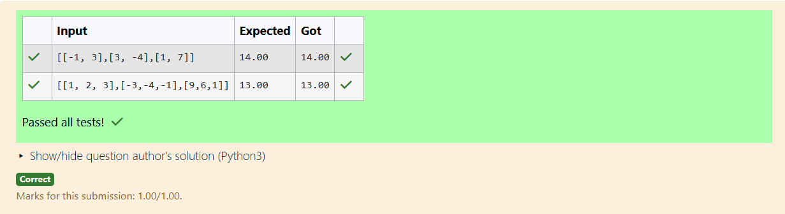
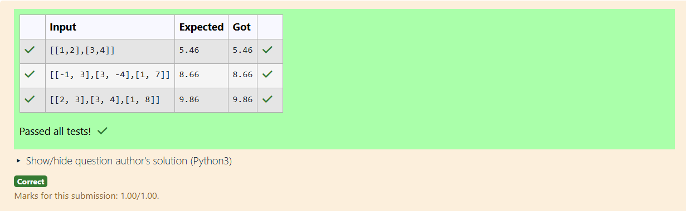
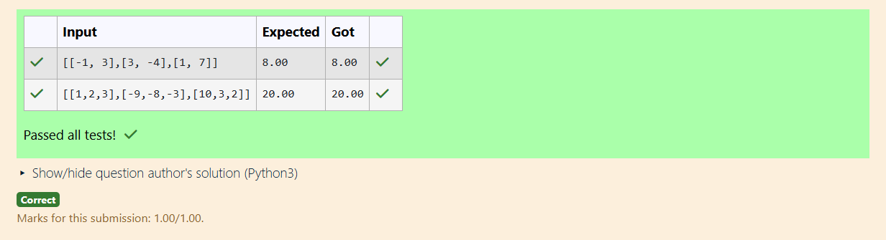

# Norm of a matrix
## Aim
To write a program to find the 1-norm, 2-norm and infinity norm of the matrix and display the result in two decimal places.
## Equipment’s required:
1.	Hardware – PCs
2.	Anaconda – Python 3.7 Installation / Moodle-Code Runner
## Algorithm:
	1. Get the input matrix using np.array()   
    2. Find the 2-norm of the matrix using np.linalg.norm()
	3. Print the norm of the matrix in two decimal places.
## Program:

	# 1-Norm of a Matrix

	'''
	Program to find 1-norm of a matrix.
	Developed by: Jude Clement Jose G
	RegisterNumber: 24005310
	'''
	import numpy as np
	mat=np.array(eval(input()))
	ans=np.linalg.norm(mat,1)
	Norm_of_matrix="{:.2f}".format(ans)
	print(Norm_of_matrix)


	# 2-Norm of a Matrix

	'''
	Program to find 2-norm of a matrix.
	Developed by: Jude Clement Jose G
	RegisterNumber: 24005310
	'''
	import numpy as np
	mat=np.array(eval(input()))
	ans=np.linalg.norm(mat,2)
	Norm_of_matrix="{:.2f}".format(ans)
	print(Norm_of_matrix)


	# Infinity Norm of a Matrix
	'''
	Program to find infinity of a matrix.
	Developed by: Jude Clement Jose G
	RegisterNumber: 24005310
	'''
	import numpy as np
	mat=np.array(eval(input()))
	ans=np.linalg.norm(mat,np.inf)
	Norm_of_the_matrix="{:.2f}".format(ans)
	print(Norm_of_the_matrix)


```
## Output:






## Result
Thus the program for 1-norm, 2-norm and Infinity norm of a matrix are written and verified.
